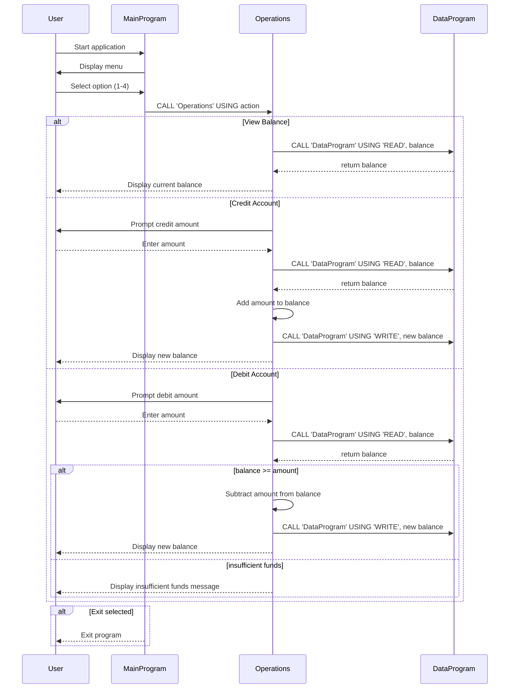

# COBOL Student Account System

This `docs/README.md` describes the legacy COBOL source files in `src/cobol/`, the purpose of each program, key logic flows, and the student account business rules implemented by the system.

## Source files

### `src/cobol/main.cob`
- Program ID: `MainProgram`
- Primary entry point for the application.
- Displays a simple menu for student account management.
- Presents options:
  - `1` View Balance
  - `2` Credit Account
  - `3` Debit Account
  - `4` Exit
- Accepts user input, validates the selection, and calls `Operations` with the selected action.
- Keeps the program running until the user chooses to exit.

### `src/cobol/operations.cob`
- Program ID: `Operations`
- Handles account operations based on the action passed from `MainProgram`.
- Recognizes three operation types:
  - `TOTAL` — read and display the current balance
  - `CREDIT` — prompt for an amount, read the current balance, add the amount, and write the new balance
  - `DEBIT` — prompt for an amount, read the current balance, check funds, subtract the amount if allowed, and write the new balance
- Uses `DataProgram` to persist and retrieve the account balance value.

### `src/cobol/data.cob`
- Program ID: `DataProgram`
- Acts as the data storage module for the student account balance.
- Supports two actions:
  - `READ` — returns the current balance from internal working storage
  - `WRITE` — updates the stored balance using the passed value
- Maintains an in-memory `STORAGE-BALANCE` value initialized to `1000.00`.

## Key functions and logic flow

1. `MainProgram` displays the menu and accepts user commands.
2. For each valid command, it calls `Operations` with one of the operation codes: `TOTAL`, `CREDIT`, or `DEBIT`.
3. `Operations` performs the requested action and delegates balance persistence to `DataProgram`.
4. `DataProgram` manages the current account balance in working storage and supports reads and writes.

## Student account business rules

- The student account starts with a default balance of `1000.00`.
- `View Balance` shows the current balance without modifying it.
- `Credit Account` increases the balance by the user-entered amount.
- `Debit Account` only succeeds when the current balance is greater than or equal to the requested debit amount.
- If the user attempts to debit more than the available balance, the system displays `Insufficient funds for this debit.` and does not update the balance.
- The menu rejects any selection outside `1-4` with an invalid choice message.
- The program loops until the user selects `4` to exit.

## Notes

- The current implementation stores the account balance in COBOL working storage rather than external files or a database.
- This code is structured as a simple example of program and module decomposition in COBOL, with separate programs for user interaction, business operations, and storage logic.

## Sequence diagram

